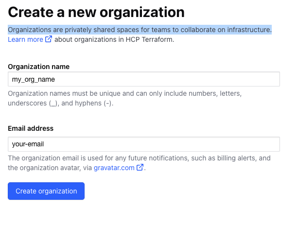
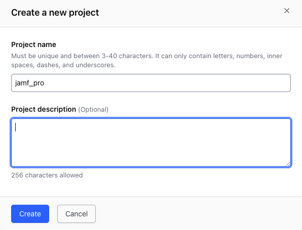
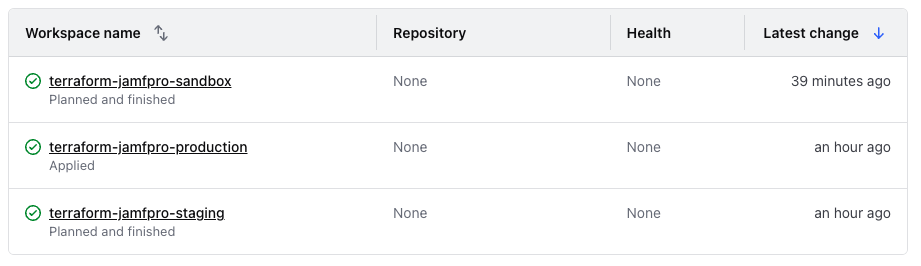
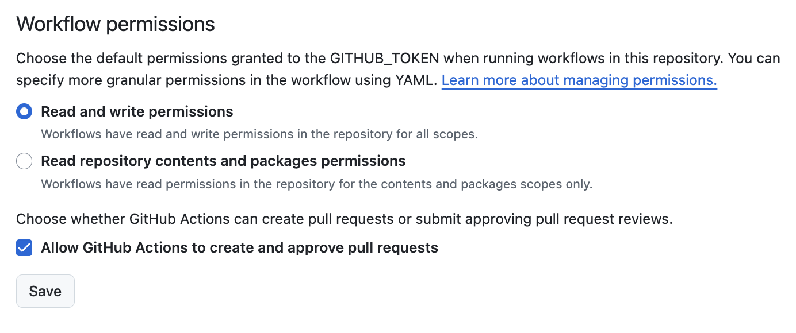

# Getting Started

## Tools Install and Install Setup

Before you start working on this project, you'll need to install several tools to ensure your development environment is properly set up.

### 1. Install an IDE (e.g., Visual Studio Code)

You will need an Integrated Development Environment (IDE) to write and manage your code efficiently. We recommend [Visual Studio Code (VSCode)](https://code.visualstudio.com/) because of its flexibility and a wide range of available extensions for Terraform and Git integration.

#### Recommended VSCode Extensions:

- **Terraform**: Provides syntax highlighting, linting, and IntelliSense for Terraform files.
  - [HashiCorp Terraform Extension](https://marketplace.visualstudio.com/items?itemName=HashiCorp.terraform)
- **YAML**: Useful for working with GitHub Actions workflows.
  - [YAML Extension](https://marketplace.visualstudio.com/items?itemName=redhat.vscode-yaml)
- **GitLens**: Enhances Git capabilities within VSCode, showing Git blame information, commit history, and more.
  - [GitLens Extension](https://marketplace.visualstudio.com/items?itemName=eamodio.gitlens)
- **Prettier - Code Formatter**: Ensures consistent formatting of your code.
  - [Prettier Extension](https://marketplace.visualstudio.com/items?itemName=esbenp.prettier-vscode)

### 2. Install Git

Git is essential for version control and managing your project’s source code. Install it from the official website based on your operating system:

- [Git for Windows](https://git-scm.com/download/win)
- [Git for macOS](https://git-scm.com/download/mac)
- [Git for Linux](https://git-scm.com/download/linux)

Once Git is installed, you can verify the installation by running the following command in your terminal or command prompt:

```bash
git --version
```

### 3. Set Up Git User Information

After installing Git, you need to configure your user information. This information is used to track who made the changes in the Git commit history.

Run the following commands to set your Git username and email globally (this can be specific to your GitHub account or organization).

```bash
git config --global user.name "Your Name"
git config --global user.email "your-email@example.com"
```

To verify that the configuration was successful, run:

```bash
git config --global --list
```

### 4. Install Terraform

Terraform is required to manage the infrastructure resources in this project. You can download it from the official Terraform website:

- [Download Terraform](https://www.terraform.io/downloads.html)

After installing Terraform, verify the installation by running the following command:

```bash
terraform --version
```

## Project Setup

1. **Create a New Repository**: Start by forking or cloning this repository into your GitHub account. Ensure that you include all branches when you fork.

**Optional: Clone and Push to Your New Repository**: If cloning then take a local copy of this repo and then push it to your newly created repository:

```bash
git clone https://github.com/deploymenttheory/terraform-demo-jamfpro.git
cd terraform-demo-jamfpro
git remote set-url origin https://github.com/your-username/your-new-repo.git
git push -u origin main
```

Replace your-username and your-new-repo with your GitHub username and the name of your new repository.

2. **Configure Terraform Cloud Workspaces**:

To manage your Jamf Pro infrastructure across different environments, you'll need to set up a terraform cloud organization, project and 3 workspaces. You will require a seperate workspace for each jamf pro envionrment you want to manage with terraform.

Setup an account within terraform cloud if you havent already -

- [Terraform Cloud](https://app.terraform.io/)

And create a new terraform cloud organization. Organizations are privately shared spaces for teams to collaborate on infrastructure.


- **Create Terraform Cloud Project**:
   Create a new project in Terraform Cloud for your Jamf Pro infrastructure.


- **Create Terraform Cloud Workspaces**:

  Assigned to your project three workspaces in Terraform Cloud with the following names:

   - `terraform-jamfpro-sandbox`
   - `terraform-jamfpro-staging`
   - `terraform-jamfpro-production`

   Use `API-driven workflow` for each workspace.

Each workspace holds a unique state for the correlating jamf pro environment.


- **Tag Workspaces**:
   Tag each of these workspaces with the "jamf_pro" tag. This allows you to easily identify and group these workspaces and it will allow us to apply terraform
   variable sets (collections of variables true across multiple jamf pro environments)

- **Set Up Variable Set for Common Variables**:
   Create a variable set for variables that are common across all environments, set the following variables as `Terraform variable`:
   
   a. In Terraform Cloud, go to your organization settings.
   b. Click on "Variable sets" and then "Create variable set".
   c. Name it something like "Jamf Pro Common Variables".
   d. Add the following variables:

    - `enable_client_sdk_logs`: Set to "false"
    - `client_sdk_log_export_path`: Set to "" - empty
    - `jamfpro_jamf_load_balancer_lock`: Set to "true"
    - `jamfpro_token_refresh_buffer_period_seconds`: Set to "100"
    - `jamfpro_mandatory_request_delay_milliseconds`: Set to "300"

   f. Apply this variable set to all three Jamf Pro workspaces.

- **Configure Workspace-Specific Variables**:
   For each workspace, set the following variables as `Terraform variable`:

   a. Go to the workspace settings in Terraform Cloud.
   b. Navigate to the "Variables" section.
   c. Add the following variables:

    - `jamfpro_instance_fqdn`: The FQDN of your Jamf Pro instance for this environment.
    - `jamfpro_client_id`: Your Jamf Pro client ID (for OAuth2)
    - `jamfpro_client_secret`: Your Jamf Pro client secret (for OAuth2)
    - `jamfpro_basic_auth_username`: Your Jamf Pro username (for basic auth)
    - `jamfpro_basic_auth_password`: Your Jamf Pro password (for basic auth)

   d. Mark sensitive variables (like passwords and secrets) as sensitive.

- **Access Controls**:
   Set up appropriate access controls for each workspace:
   
   a. Go to the "Team Access" section in each workspace's settings.
   b. Assign the appropriate permissions to team members based on their roles and the environment.
   c. Consider restricting access to production workspaces to a smaller group of trusted team members.


3. **Configure Github Secrets**: Set up the following secrets in your GitHub repository settings:

- `TF_API_TOKEN`: Your Terraform Cloud API token for Terraform Cloud backend. this can be generated from the Terraform Cloud UI under account settings -> Tokens -> create api token.
- `PAT_TOKEN`: Your GitHub Personal Access Token for branch management operations.

To set up the PAT_TOKEN:
a. Go to your GitHub Settings > Developer settings > Personal access tokens > Fine-grained tokens.
b. Click "Generate new token".
c. Give your token a descriptive name, e.g., "Terraform Jamf Pro Config Branch Management".
d. Set the expiration as per your security policies.
e. Under "Repository access", select "Only select repositories" and choose the repository you're setting up.
f. Under "Permissions", grant the following permissions:

- Repository permissions:
- Contents: Read and write (This allows branch management)
- Metadata: Read-only (This is required for API operations)
- Organization permissions:
- Members: Read-only (If working within an organization)

g. Click "Generate token" and copy the token immediately.
h. In your repository, go to Settings > Secrets and variables > Actions.
i. Click "New repository secret", name it PAT_TOKEN, and paste your token as the value.

Optional:

- `MSTEAMS_WEBHOOK_URL`: Your Microsoft Teams webhook URL for sending notifications.
- `SLACK_WEBHOOK_URL`: Your Slack webhook URL for sending notifications.

(If you are not planning to integrate with either ms teams for slack then remove these steps from your pipelines.)

To set up the notification webhooks:

a. For Microsoft Teams:

- In your Teams channel, click the '...' next to the channel name and select 'Connectors'.
- Find 'Incoming Webhook' and click 'Configure'.
- Provide a name for your webhook and optionally upload an image.
- Click 'Create' and copy the webhook URL provided.
- In your GitHub repository, go to Settings > Secrets and variables > Actions.
- Click "New repository secret", name it MSTEAMS_WEBHOOK_URL, and paste the webhook URL as the value.

b. For Slack:

- Go to your Slack workspace's App Directory and create a new app (or use an existing one).
- Under 'Features', select 'Incoming Webhooks' and activate them.
- Click 'Add New Webhook to Workspace' and select the channel for notifications.
- Copy the webhook URL provided.
- In your GitHub repository, go to Settings > Secrets and variables > Actions.
- Click "New repository secret", name it SLACK_WEBHOOK_URL, and paste the webhook URL as the value.

These webhook URLs are used in the Send Notification workflow (send-notification.yml) to send deployment status updates to your team. The workflow determines which service to use based on the notification_channel input.

4. **Configure Terraform Cloud Secrets**:

Set up the following secrets in your Terraform Cloud workspace variable settings for each environment (Sandbox, Staging, Production):
    - `JAMFPRO_INSTANCE_FQDN`: Your Jamf Pro instance URL. For example: `https://your-instance.jamfcloud.com`.
    - `JAMFPRO_AUTH_METHOD`: Can be either `basic` or `oauth2`.
    - `JAMFPRO_CLIENT_ID`: Your Jamf Pro client id when `JAMFPRO_AUTH_METHOD` is set to 'oauth2'.
    - `JAMFPRO_CLIENT_SECRET`: Your Jamf Pro client secret when `JAMFPRO_AUTH_METHOD` is set to 'oauth2'.
    - `JAMFPRO_BASIC_AUTH_USERNAME`: Your Jamf Pro username when `JAMFPRO_AUTH_METHOD` is set to 'basic'.
    - `JAMFPRO_BASIC_AUTH_PASSWORD`: Your Jamf Pro user password when `JAMFPRO_AUTH_METHOD` is set to 'basic'.

   Note: For Terraform Cloud, when setting variables you do not need to prefix your env vars with `TF_VAR_` as Terraform Cloud automatically does this for you. Additionally, ensure to select the variable category as `Terraform variable`, with the HCL tickbox unchecked.

5. **GitHub Repository-Level Setting**:

At the repository level, you need to explicitly allow GitHub Actions to create or approve pull requests by adjusting the workflow permissions for your demo repository.

Steps:

- Navigate to the repository on GitHub.
- Go to Settings > Actions > General.
- Scroll down to Workflow permissions.
- Choose "Read and write permissions".
- Check the box for "Allow GitHub Actions to create and approve pull requests".
- Click Save.



6. ### Create a New Ruleset to Protect `staging` and `production` Branches

1. **Navigate to Repository Settings**:
   - Go to your repository on GitHub.
   - Click on **Settings** in the repository navigation.

2. **Access Rulesets**:
   - In the **Settings** sidebar, scroll down and click on **Rules**.
   - Then, select **Rulesets**.

3. **Create a New Ruleset**:
   - Click the **New ruleset** button to create a new branch protection ruleset.

4. **Give the Ruleset a Name**:
   - In the **Name** field, enter a name of your choice, such as `ruleset-protect-staging+production`.

5. **Set the Bypass List**:
   - In the **Bypass list** section, add `Organization admin` as an exemption. This will allow organization admins to bypass the rules if necessary.

6. **Target Branches**:
   - Under **Target branches**, add the branches you want to protect:
     - `staging`
     - `production`

7. **Configure Branch Rules**:
   - Set the following branch protection rules:

     - **Restrict deletions**: Enable this option to prevent deletion of the `staging` and `production` branches.
     
     - **Require a pull request before merging**: Enable this option to ensure that all changes are reviewed before merging.
       - **Required approvals**: Set this to `1` to ensure at least one approval is required for merging.
       - **Dismiss stale pull request approvals when new commits are pushed**: Enable this option to dismiss previous approvals when new commits are made.
       - **Require approval of the most recent reviewable push**: Enable this option to ensure that only the most recent commit is reviewed and approved.
       - **Require conversation resolution before merging**: Enable this option to ensure that all review conversations are resolved before the pull request can be merged.

     - **Require status checks to pass**: Enable this to ensure that all required status checks (e.g., CI/CD tests) pass before a pull request is merged.

     - **Block force pushes**: Enable this to block any force pushes to the `staging` and `production` branches, ensuring that no one can overwrite the branch history.

8. **Save the Ruleset**:
   - After configuring all of the rules, click **Create** or **Save** to apply the new ruleset to the `staging` and `production` branches.


6. **Update Terraform Variables**: Modify the `terraform` block in your `.tf` files to match your Jamf Pro instance details. For example:

   ```hcl
   provider "jamfpro" {
     jamfpro_instance_fqdn                = var.jamfpro_instance_fqdn
     jamfpro_load_balancer_lock           = var.jamfpro_jamf_load_balancer_lock
     auth_method                          = var.jamfpro_auth_method
     client_id                            = var.jamfpro_client_id
     client_secret                        = var.jamfpro_client_secret
     log_level                            = var.jamfpro_log_level
     log_output_format                    = var.jamfpro_log_output_format
     log_console_separator                = var.jamfpro_log_console_separator
     log_export_path                      = var.jamfpro_log_export_path
     export_logs                          = var.jamfpro_export_logs
     hide_sensitive_data                  = var.jamfpro_hide_sensitive_data
     token_refresh_buffer_period_seconds  = var.jamfpro_token_refresh_buffer_period_seconds
     mandatory_request_delay_milliseconds = var.jamfpro_mandatory_request_delay_milliseconds
   }
   ```

   It's strongly recommended for beginners to ensure that `jamfpro_load_balancer_lock` is set to true, to avoid any issues with the Jamf Pro load balancer.

7. **Backend Configuration**: For our multi-environment setup, we'll be using Terraform workspaces. This approach allows us to use a single set of configuration files while maintaining separate states for each environment. Here's how to structure it:

   In your main Terraform configuration file (e.g., `main.tf`):

   ```hcl
    terraform {
      cloud {
        organization = "deploymenttheory"
        workspaces {
          tags = ["jamf_pro"]
        }
      }
    }
   ```

   This configuration tells Terraform to use Terraform Cloud with the "deploymenttheory" organization and to work with any workspace tagged with "jamfpro".


8. **Terraform Provider Configuration**: Specify the provider source and version:

   ```hcl
   terraform {
     required_providers {
       jamfpro = {
         source  = "deploymenttheory/jamfpro"
         version = "0.3.1"
       }
     }
   }
   ```

9. **Define Your Resources**: Use Terraform resource definitions to manage your Jamf Pro resources.

10. **Create a New Branch**: When starting work on a new feature, bug fix, or any other change, create a new branch with an appropriate prefix. This naming convention is enforced by our workflows and helps categorize the type of work being done.

Use one of the following prefixes based on the nature of your work:

- `feat-`: For new features
- `fix-`: For bug fixes
- `docs-`: For documentation changes
- `style-`: For formatting, missing semi colons, etc; no code change
- `refactor-`: For refactoring production code
- `test-`: For adding missing tests, refactoring tests; no production code change
- `chore-`: For updating grunt tasks etc; no production code change
- `build-`: For changes that affect the build system or external dependencies
- `ci-`: For changes to our CI configuration files and scripts
- `perf-`: For performance improvements

To create a new branch:

1. Ensure you're on the default branch (sandbox) and it's up to date:
   ```bash
   git checkout sandbox
   git pull origin sandbox
   ```

2. Create and switch to a new branch with an appropriate prefix:
   ```bash
   git checkout -b prefix-branch-name
   ```
   Replace `prefix-` with one of the prefixes listed above, and `branch-name` with a brief, descriptive name for your change.

   For example:
   ```bash
   git checkout -b feat-add-policy
   ```

3. Make your changes on this new branch.

4. Push your branch to the remote repository:
   ```bash
   git push -u origin prefix-branch-name
   ```

This naming convention helps our automated workflows identify the type of change and process it accordingly. It also makes it easier for team members to understand the purpose of each branch at a glance.

11. **Make Changes and Push**: Make your changes and push to GitHub.

12. **Test in Sandbox**: The `01 - terraform testing: sandbox` workflow will automatically run and perform terraform plans and linting upon each commit.

13. **Promote to Sandbox**: After testing your changes in your feature branch, you can promote them to the Sandbox environment. This process involves creating a pull request to merge your feature branch into the `sandbox` branch. Here's how to do it:

- Ensure all your changes are committed and pushed to your feature branch.

- Go to your repository on GitHub.

- Click on the "Pull requests" tab.

- Click the "New pull request" button.

- Set the base branch to `sandbox` and the compare branch to your feature branch.

- Give your pull request a descriptive title and provide details about the changes in the description.

- Click "Create pull request".

- Request a review from your team members if required by your team's process.

- Once the pull request is approved, merge it into the `sandbox` branch.

Important: The actual application of changes to the Sandbox environment is handled automatically by the "02 - terraform apply to: sandbox" workflow. This workflow is triggered when a pull request is merged into the `sandbox` branch.

After merging:
- The workflow will automatically start.
- It will apply the Terraform changes to the Sandbox environment.
- You can monitor the progress of this workflow in the "Actions" tab of your GitHub repository.

Remember: Always verify that the workflow completes successfully. If there are any issues, they will be reported in the workflow run logs.

By following this process, you ensure that your changes are properly promoted to the Sandbox environment and applied in a controlled, automated manner.

14. **Promote to Staging**: Now manually trigger the `02-release-and-plan-staging.yml` workflow and approve the pull request to merge the release branch into the `staging` branch after change review.

15. **Apply to Staging**:

This project uses an automated process for creating versions and preparing releases when promoting changes from the Sandbox environment to Staging. This process is implemented in the `03 - release and terraform plan to: staging` workflow. Here's an overview of how it works:

### Triggering the Process

The release process is initiated manually. To start this process:

1. Go to the "Actions" tab in your GitHub repository.
2. Find the "03 - release and terraform plan to: staging" workflow.
3. Click "Run workflow".
4. Select the `sandbox` branch as the base for the release.
5. Click "Run workflow" to start the process.

### What Happens During the Process

Once triggered, the workflow performs the following steps:

1. **Version Creation**:
   - The workflow automatically determines the next version number based on semantic versioning principles.
   - It creates a new tag with this version number.
   - A new release is created in GitHub with this tag.

2. **Branch Creation**:
   - A new branch is created with the name pattern `release-v{version}-to-staging`.
   - This branch contains all the changes that were in the `sandbox` branch.

3. **Terraform Plan**:
   - The workflow runs a Terraform plan against the Staging environment.
   - This plan shows what changes will be applied to the Staging environment if this release is approved.

4. **Pull Request Creation**:
   - A pull request is automatically created to merge the release branch into the `staging` branch.
   - The pull request description includes:
     - The new version number
     - A summary of the Terraform plan (resources to be added, changed, or destroyed)
     - A link to the full Terraform plan in Terraform Cloud

### Next Steps

After the workflow completes:

1. Review the pull request and the Terraform plan carefully.
2. If everything looks correct, approve and merge the pull request.
3. Merging the pull request will trigger the "04 - terraform apply to: staging" workflow, which will apply the changes to the Staging environment.

### Important Notes

- Always review the Terraform plan before approving the release to Staging.
- The version number is automatically incremented. You don't need to manually manage version numbers.
- Each release creates a permanent tag in your repository's history, making it easy to track what changes were included in each release.
- If you need to make changes after creating a release but before applying to Staging, you can push additional commits to the release branch before merging the pull request.

This automated process ensures consistent versioning, provides a clear history of releases, and allows for a final review before applying changes to the Staging environment.

14. **Promote to Production**: Repeat the process for promoting to Production by manually triggering the `04-release-and-plan-production.yml` workflow and approving the pull request to merge the release branch into the `production` branch after change review.

15. **Apply to Production**: After the pull request is merged, the `05-terraform-apply-production.yml` workflow will automatically run to apply the changes to the Production environment.
